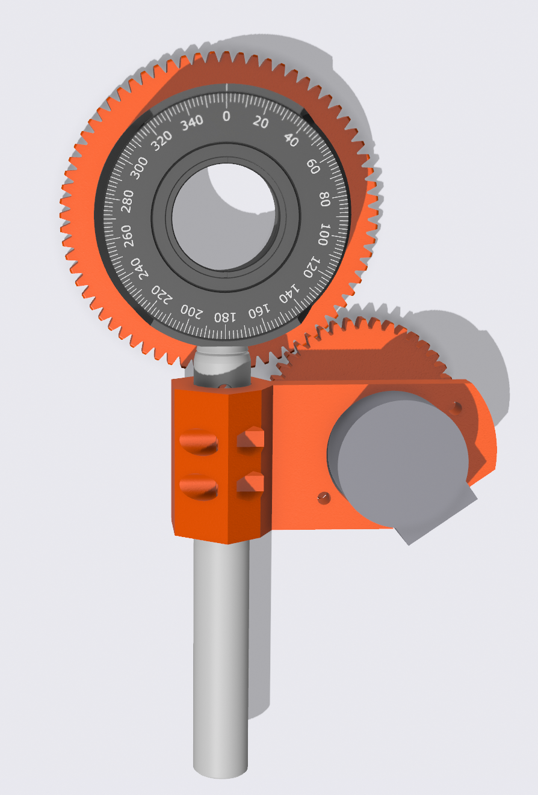
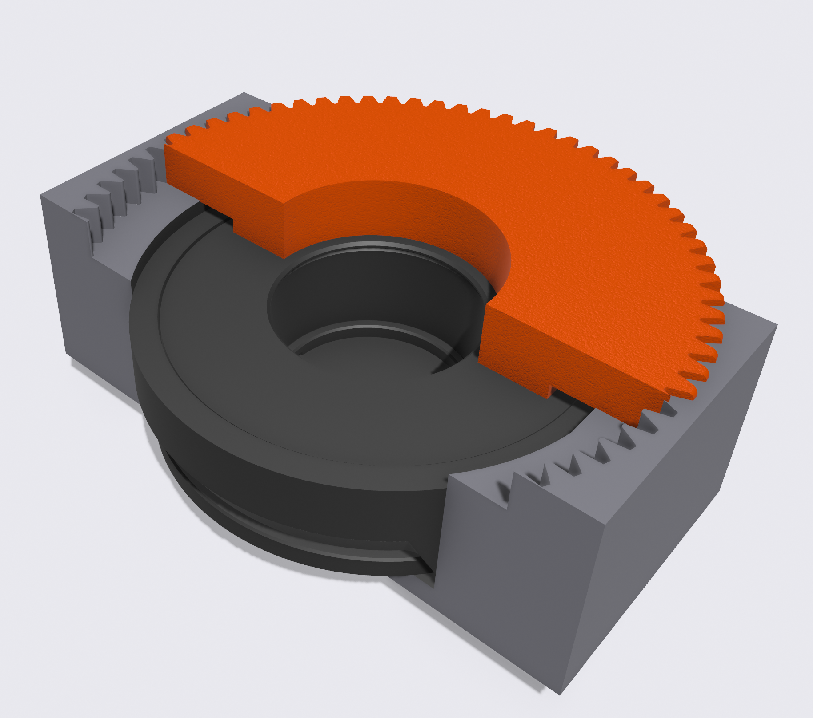

# Description
This repository contains all files needed to convert a RSP1 rotation mount from Thorlabs (https://www.thorlabs.de/thorproduct.cfm?partnumber=RSP1/M#ad-image-0) into a motorized mount, with computer controlled rotation.

Here we provide both the 3D model, as well as .stl files of the individual parts that need to be printed.

Part that need to be printed are:
- 1x Alignment tool (only needed for assembly)
- 1x Motor Mount
- 1x Mount Bracket
- 1x Cog large
- 1x Cog small

Additional parts:
1x 28BYJ-48 stepper motor
1x superglue
M3 fasteners 

To computer control the motors we use an Arduino MEGA with sensor shield, as described here - https://github.com/HorkeLab/arduino_28BYJ-48

# Printing and assembly instructions
We have printed these in PETG, but PLA should also be fine. A well-calibrated printer is necessary to avoid excessive friction/stalling of the motors. Typically printed on 0.4mm nozzle, 0.2mm layer height, 15\% infill.

The large cog needs to be glued to the rotation mount. We recommend gluing it to the back side (i.e. the side that does not have the marked scale on it). It is very important that the cog is centred on the rotation mount. For this we use the alignment tool - first insert the mount into the alignment tool, apply superglue to the rotating surface, then insert the large cog (with the 'lip' facing down), as shown in the image below. Now put some heavy textbook on top and go have a coffee while the glue dries.

The remaining assembly is fairly straightforward. Make sure the cogs are parallel to each other and well aligned. The 28BYJ-48 is quite a small low torque motor, you might have to reduce the speed to have sufficient torque to reliably rotate the mount. Some grease/oil can also help with this, and of course make sure the locking screw on the mount is not tightened.